<div align="center">

<!-- ══════════════════ CUSTOM ANIMATED HEADER (meteors + particles + glow) ══════════════════ -->


<!-- ══════════════════ TYPING ANIMATION ══════════════════ -->
<a href="https://git.io/typing-svg">
  
</a>

<br/><br/>

<!-- ══════════════════ DYNAMIC BADGES ══════════════════ -->

&nbsp;

&nbsp;

&nbsp;


<br/><br/>

<!-- ══════════════════ SOCIAL LINKS ══════════════════ -->
<a href="mailto:reenkdk2314@gmail.com"></a>
&nbsp;
<a href="https://guestlist.id"></a>
&nbsp;
<a href="https://github.com/Rastyaa"></a>

</div>


<!-- ══════════════════ ABOUT ME ══════════════════ -->
##  About Me


```typescript
const rendrastya = {
  role: "Fullstack Developer",
  company: "Guestlist.id 🌴",
  location: "Bali, Indonesia",
  frontend: ["React", "Next.js", "TypeScript"],
  backend: ["Go", "Node.js", "PostgreSQL"],
  mobile: ["React Native", "Flutter"],
  infra: ["Docker", "Firebase", "Cloudflare"],
  currentFocus: "Booking platforms & clean APIs",
  funFact: "My best debugging happens at 2 AM 🌙",
  contact: "reenkdk2314@gmail.com",
};
```

- 🔭 Building **[Guestlist.id](https://guestlist.id)** — Bali's activity & experience booking platform
- 🌱 Deep-diving into **Go backend architecture** & database design
- ⚡ Fun fact: *code compiles faster when the coffee is strong* ☕

<br clear="right"/>


<!-- ══════════════════ TECH STACK ══════════════════ -->
##  Tech Arsenal

<div align="center">

### 💻 Languages & Frameworks


### 🗄️ Database & Backend


### 📱 Mobile & Tools


</div>


<!-- ══════════════════ GITHUB STATS ══════════════════ -->
##  GitHub Analytics

<div align="center">


<br/><br/>


<br/><br/>


</div>


<!-- ══════════════════ TOP LANGUAGES ══════════════════ -->
##  Top Languages

<div align="center">

</div>


<!-- ══════════════════ RANDOM QUOTE & JOKE ══════════════════ -->
##  Daily Dose

<div align="center">


<br/>


</div>

<br/>

<!-- ══════════════════ FOOTER ══════════════════ -->
<div align="center">

### 💬 Let's build something cool together!

<a href="mailto:reenkdk2314@gmail.com">
  
</a>


</div>
